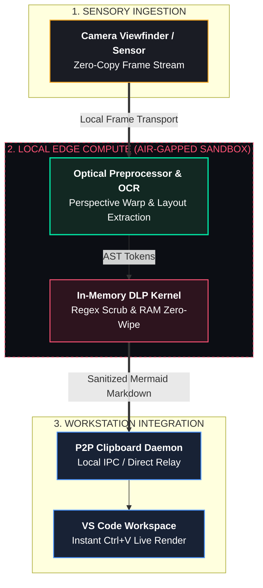

# Origin DevBridge // Air-Gapped Whiteboard-to-IDE Compiler

[](https://opensource.org/licenses/MIT)
[](https://www.python.org/downloads/)
[](#security--air-gap-guarantees)
[](#system-architecture)

> **Zero-Cloud, Privacy-First Architecture Synthesizer:** Converts physical whiteboard sketches into executable Mermaid.js diagrams directly to your desktop clipboard using split-tier local edge compute.

---

## Table of Contents
- [Executive Summary](#executive-summary)
- [System Architecture](#system-architecture)
- [Key Features](#key-features)
- [Security & Air-Gap Guarantees](#security--air-gap-guarantees)
- [Repository Structure](#repository-structure)
- [API Architecture](#api-architecture)
- [Quickstart & Installation](#quickstart--installation)
- [Configuration Reference](#configuration-reference)
- [Verification & Test Fixtures](#verification--test-fixtures)
- [License](#license)

---

## Executive Summary

Engineering teams spend 15–20 minutes manually transcribing physical whiteboard brainstorming sessions into documentation tools. Existing cloud-based visual AI solutions introduce critical enterprise security vulnerabilities by uploading sensitive system architecture diagrams and potential embedded credentials to third-party servers.

**Origin DevBridge** implements an air-gapped, zero-cloud pipeline:
1. **Ingests** sketches via mobile optical sensors.
2. **Rectifies & Binarizes** the image locally using OpenCV.
3. **Scans & Scrubs** high-entropy credentials directly in volatile RAM via an in-memory DLP kernel.
4. **Compiles** topological layout into deterministic Mermaid.js markdown.
5. **Bridges** the output directly to the workstation OS clipboard (`Ctrl + V`) via local P2P IPC.

---

## System Architecture



## Key Features

* **Split-Tier Edge Processing:** Uses the mobile phone (e.g., vivo Y16) as an optical capture node while offloading compute to the local developer workstation over LAN.
* **Hardware-Isolated DLP:** Detects API keys (OpenAI, GitHub, AWS), bearer tokens, and credentials before syntax generation.
* **Volatile RAM Purge:** Utilizes C-level memory zeroing (`ctypes.memset`) to wipe decrypted frame buffers and token arrays immediately following AST synthesis.
* **Zero Cloud Footprint:** No external API keys, cloud credits, or WAN connectivity required. Operates seamlessly in secure flight environments, SCIF facilities, and offline development networks.

---

## Security & Air-Gap Guarantees

| Metric | Target Specification | Enforcement Mechanism |
| --- | --- | --- |
| **WAN Network Egress** | `0.00 KB` | Localhost/LAN socket binding (`0.0.0.0`) |
| **Token Scrub Latency** | `< 25ms` | In-memory compiled single-pass regex |
| **Volatile RAM Retention** | `0 Bytes` post-synthesis | In-place zero-fill via `ctypes.memset` |
| **Storage Persistence** | Ephemeral | In-memory frame processing; zero temporary disk writes |

---

## Repository Structure

```text
origin-devbridge/
├── README.md                   # Complete architectural documentation & user manual
├── requirements.txt            # Minimal offline runtime dependencies
├── config.py                   # Port, host, and regex heuristic rules
├── run.py                      # Unified local execution runner
│
├── core_engine/                # Vision & AST Synthesis Layer
│   ├── __init__.py
│   ├── preprocessor.py         # OpenCV perspective transform & adaptive binarization
│   ├── ocr_pipeline.py         # Spatial text extraction & directional graph parser
│   └── mermaid_compiler.py     # AST-to-Mermaid.js compiler
│
├── security_dlp/               # Privacy & Air-Gap Defense Layer
│   ├── __init__.py
│   ├── regex_patterns.py       # High-entropy token signatures (OpenAI, GitHub, AWS, JWT)
│   └── sanitizer.py            # In-memory redaction & volatile buffer zero-wipe
│
├── bridge/                     # Workstation IPC Layer
│   ├── __init__.py
│   └── clipboard_daemon.py     # Local desktop clipboard syncer (pyperclip / OS IPC)
│
├── mobile_client/              # Optical Capture Client
│   ├── __init__.py
│   ├── camera_stream.py        # Frame ingestion handler
│   └── web_viewfinder.html     # Minimal local UI for viewfinder capture
│
├── samples/                    # Evaluation Fixtures
│   ├── sample_sketch_01.png
│   ├── sample_sketch_01.mmd    # Expected Mermaid output
│   ├── sample_with_secrets.png
│   └── sample_with_secrets.mmd # Expected sanitized Mermaid output
│
└── tests/
    ├── test_preprocessor.py    # Geometry & warp verification
    ├── test_dlp_scrubber.py    # Zero-retention secret redaction tests
    └── test_ast_generation.py  # Graph syntax validity tests

```

---

## API Architecture

The local runner exposes lightweight, decoupled endpoints designed for zero-cloud LAN or local loopback operation (`0.0.0.0:8000`):

### 1. Optical Ingest

* **Endpoint:** `POST /api/v1/ingest`
* **Payload:** `multipart/form-data` (`image: binary`)
* **Action:** Runs perspective rectification and adaptive thresholding.
* **Response:**
```json
{
  "status": "INGESTED",
  "rectified": true,
  "dimensions": {"width": 1280, "height": 720},
  "frame_id": "frm_88a91c"
}

```


### 2. Synthesize & Sanitize

* **Endpoint:** `POST /api/v1/compile`
* **Payload:**
```json
{
  "frame_id": "frm_88a91c",
  "target_dialect": "mermaid"
}

```


* **Response:**
```json
{
  "mermaid_syntax": "graph TD\n  Client[Mobile Sensor] --> Gateway[Local Bridge]\n  Gateway --> IDE[VS Code Workspace]",
  "telemetry": {
    "preprocess_ms": 42,
    "inference_ms": 78,
    "dlp_scrub_ms": 14,
    "wan_egress_bytes": 0,
    "redactions_applied": 1
  }
}

```


### 3. Workstation Relay

* **Endpoint:** `POST /api/v1/bridge/copy`
* **Payload:** `{"payload": "graph TD\n..."}`
* **Action:** Pipes the string to the host operating system clipboard.

---

## Quickstart & Installation

### 1. Clone Repository

```bash
git clone [https://github.com/](https://github.com/)<your-username>/origin-devbridge.git
cd origin-devbridge

```

### 2. Setup Virtual Environment

```bash
# Linux/macOS
python3 -m venv venv
source venv/bin/activate

# Windows
python -m venv venv
venv\Scripts\activate

```

### 3. Install Dependencies

```bash
pip install -r requirements.txt

```

> `pytesseract` requires the native Tesseract OCR executable to be installed on the system.
>
> - macOS: `brew install tesseract`
> - Ubuntu/Debian: `sudo apt-get update && sudo apt-get install -y tesseract-ocr`
> - Windows: install Tesseract OCR from the official installer and ensure `tesseract.exe` is on `PATH`.
>
> If Tesseract is not on `PATH`, set `TESSERACT_CMD` before running the app, for example:
> - macOS/Linux: `export TESSERACT_CMD=/absolute/path/to/tesseract`
> - Windows PowerShell: `$env:TESSERACT_CMD='C:\path\to\tesseract.exe'`

### 4. Run the Engine

```bash
python run.py

```

* Open `http://localhost:8000` on your desktop browser to view the real-time execution telemetry and live diagram renderer.
* On your mobile device (e.g., vivo Y16), ensure you are on the same Wi-Fi network and navigate to `http://<YOUR_HOST_LOCAL_IP>:8000` to open the viewfinder intake interface.

---

## Configuration Reference

Edit `config.py` to adapt the engine to your local network and interface parameters:

```python
# Network Parameters
HOST = "0.0.0.0"
PORT = 8000
DEBUG = False

# Image Rectification Parameters
MAX_FRAME_WIDTH = 1280
ADAPTIVE_BLOCK_SIZE = 15
ADAPTIVE_C_CONSTANT = 8

# Security & DLP Rules
ENABLE_MEMORY_PURGE = True
ENFORCE_AIR_GAP_CHECK = True
CUSTOM_SECRET_PATTERNS = {
    "INTERNAL_TOKEN": r"corp-[a-zA-Z0-9]{16,}"
}

```

---

## Verification & Test Fixtures

Run the self-contained unit test suite to verify DLP scrubbing, perspective transforms, and syntax compilation:

```bash
# Test in-memory DLP redaction & memory wiping
python -m unittest tests/test_dlp_scrubber.py

# Test image preprocessing & contour detection
python -m unittest tests/test_preprocessor.py

# Test AST syntax generation
python -m unittest tests/test_ast_generation.py

```

---

## License

Distributed under the MIT License. See `LICENSE` for more information.

```

### How to turn this into your local file in 5 seconds
Run this in your project terminal:
```bash
cat << 'EOF' > README.md
# Paste the content above
EOF

```

Or simply create a file named `README.md` in VS Code and paste the block directly.
